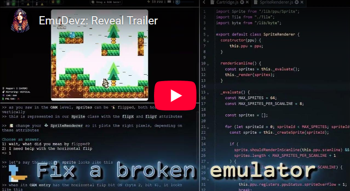

# EmuDevz

🕹️ A game about coding emulators! [Check it out!](https://afska.github.io/emudevz)

[](https://www.youtube.com/watch?v=sBhFulSp4KQ)

>  Created by [[r]labs](https://r-labs.io).

## Key features

- Full 🕹️ NEEES emulation guide from scratch
- Interactive 🔨 6502 Assembly tutorial
- Implement 🧠 CPU, 🖥️ PPU, and 🔊 APU in any order
- Play 👾 homebrew games to unlock ROMs
- 🧪 Unit tests, video tests, and audio tests are provided
- 💻 Unix-style shell and code editor
- 🎶 Original retro-synthwave soundtrack
- 📃 Included documentation and in-game dictionary
- 🗣️ Fully localized into English and Spanish
- 🐞 Powerful debugger with:
  * 🐏 Memory viewer
  * 🔢 Instruction log
  * 🏞️ Name tables, CHR, Sprites, Palettes
  * ♒ Individual APU channel views
  * 🎮 Controllers
  * 🗃️ Emulator logging
- 🔭 **Free mode** to use the IDE to develop emulators for other systems!

## Development

### Install and run

```bash
# install nvm & node
npm install
npm start
```

### Scripts

- Package levels:
  `npm run package`
- Sort locales:
  `node scripts/sort-locales.js`
- Sort dictionary entries:
  `node scripts/sort-locales.js`
- Build:
  `npm run build`
- Deploy to GitHub Pages:
  `npm run deploy <GH_USERNAME> <GH_TOKEN>`

### Generate licenses

```
cp pre-licenses.txt public/licenses.txt
yarn licenses generate-disclaimer --prod >> public/licenses.txt
```
